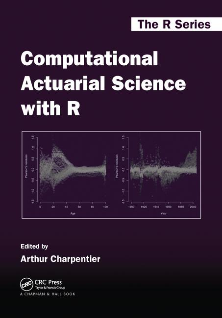

```{r echo=FALSE, warning=FALSE, purl=FALSE}
library(knitr)
```


# Introdução


## Objetivo

- O objetivo do curso é apresentar uma série de funções e aplicações computacionais presentes no dia a dia de trabalho de um atuário e profissionais que venham a trabalhar com cálculo de risco. 

- O curso vai abordar tópicos básicos de manipulação e análise de bases de dados no R, juntamente com as principais funções para aplicações de cálculos de risco, matemática atuarial e tarifação de seguros.

- **Pré-requisitos: Técnicas Atuariais I**


## Informações

Site: http://www.est.ufmg.br/~thaispaiva/Disciplinas/2018_1/MetComp/


## Bibliografia

- Charpentier, A. (Ed.). (2014). **Computational actuarial science with R**. CRC Press.

```{r fig.align='center', out.width = "20%", echo=FALSE, purl=FALSE}
 
```

- Hothorn, T., & Everitt, B. S. (2014). **A handbook of statistical analyses using R**. CRC press.


## Avaliação

Atividade             | Nota
----------------------|----------------
Participação          | 10 pts
Listas semanais       | 40 pts
Trabalho Final        | 40 pts


# R para Atuária?


## Por que usar R

- R é um software livre e *open-source*.

- Isso faz com que o R possa ser instalado gratuitamente na maioria dos computadores e servidores.

- Por ser independente do sistema operacional e *open-source*, é a linguagem ideal para **pesquisa reproduzível**.

- E porque <span class="blue3">**atuários**</span> devem usar o R?

  + R permite que seus usuários façam análises complexas sem saber a fundo os detalhes de sistemas computacionais.

  
## Métodos Computacionais para Atuária

- Para ilustrar a importância de métodos computacionais para atuária, vamos considerar um exemplo:

  + Suponha que você precise calcular o quantil 99,5% de uma <span class="red3">soma aleatória de indenizações</span> (popular entre atuários que precisam calcular *Value-at-Risk*). 
  
  + Do ponto de vista probabilístico, precisamos encontrar, para todo $s \in \mathbb{R}$:
  
$$ F(s) = \mathbb{P}(S \leq s), \mbox{ onde }\,\, S = \sum_{i=1}^N X_i $$


## Exemplo - Soma de Indenizações

  + Sob independência, podemos usar uma fórmula para a convolução:
  
$$ F(s) = \sum_{n=0}^{\infty} F_X^{*n}(x) \,.\, \mathbb{P}(N=n) $$

  + Precisamos estimar:
     1. a distribuição das **indenizações** $X_i$;
     2. e a distribuição do **número de sinistros** $N$.


## Exemplo - Soma de Indenizações {.build}

  + Vamos simular uma amostra de 200 indenizações:
```{r}
# fixar a semente
set.seed(1)
# gerar uma amostra de tamanho 200
X = rexp(200, rate=1/100)
head(X)
```
  + Média?
```{r}
mean(X)
```
  + Vamos supor que essas são as nossas observações.
  

## Exemplo - Soma de Indenizações 

- Vamos estimar a <span class="blue3">distribuição dos $X_i's$</span>. 

- Uma distribuição razoável para indenizações é a **Gama($\alpha$,$\beta$)**.

> - Um método para encontrar $\hat{\alpha}$ e $\hat{\beta}$ é resolvendo as equações normais abaixo:
    $$ \log{\hat{\alpha}} - \frac{\Gamma'(\hat{\alpha})}{\Gamma(\hat{\alpha})} - \log{\bar{X}} + \overline{\log{X}} = 0  $$
    $$\hat{\beta} = \frac{\hat{\alpha}}{\bar{X}} $$


## Exemplo - Soma de Indenizações

```{r}
# equação em função de x=alfa
f = function(x){
  log(x) - digamma(x) - log(mean(X)) + mean(log(X))
}

# encontrar a raiz da equação
alpha = uniroot(f, interval = c(1e-8,1e8))$root
alpha # estimador para alfa

beta = alpha/mean(X) # estimador para beta
beta
```


## Exemplo - Soma de Indenizações

- Com os valores de $\hat{\alpha}$ e $\hat{\beta}$, temos uma distribuição estimada para as indenizações $X_i$.

$$X_i \sim Gamma (\hat{\alpha}, \hat{\beta}) $$

> - Para o número de sinistros, vamos assumir que
$$N \sim Poisson(\lambda = 100) $$

> - Agora, precisamos calcular o quantil 99,5% da soma aleatória $S=\sum_{i=1}^N X_i$. Isso pode ser feito facilmente de maneira computacional.


## Exemplo - Soma de Indenizações

- Uma maneira é calcular numericamente (para um número fixo de termos) a fórmula da convolução:

$$ F(s) = \mathbb{P}(S \leq s) = \sum_{n=0}^{\infty} F_{X}^{*n}(x) \,.\, \mathbb{P}(N=n) $$

> - Para calcular o primeiro termo, $F_{X}^{*n}(x)$, vamos usar o fato de que a [soma de $n$ v.a.'s iid Gama$(\alpha;\, \beta)$ também é Gama](https://en.wikipedia.org/wiki/Gamma_distribution#Summation) com parâmetros $(n*\alpha; \, \beta)$.

> - O segundo termo é a função de probabilidade da Poisson.


## Exemplo - Soma de Indenizações {.build}

- Função para calcular a distribuição acumulada de $S$:
```{r}
# função da distribuição acumulada de S
F = function(x, lambda=100, nmax=1000){
  n = 0:nmax
  return( sum(pgamma(x, n*alpha, beta)*dpois(n, lambda)) )
}
```

- Agora precisamos encontrar $x$ tal que $F(x)=0.995$ (ou equivalentemente encontrar a raiz da função $F(x)-0.995=0$).
```{r}
# encontrando o quantil .995
uniroot(function(x) F(x)-.995, c(1e-8,1e8) )$root
```


## Exemplo - Soma de Indenizações

- Isso quer dizer que, com os valores estimados de $\hat{\alpha}=$ `r round(alpha,2)`, $\hat{\beta}=$ `r round(beta,2)`, e assumindo $\lambda=100$, temos um quantil estimado para a soma aleatória das indenizações.

$$\mathbb{P} \left( S = \sum_{i=1}^N X_i \leq 13654.43 \right) = 0.995 $$


## Exercícios | Estendendo o exemplo

1) Repetir o exemplo da aula, mudando o valor da *semente*.

2) Você pode mudar também o *tamanho da amostra* e a *média* que usamos para gerar as primeiras observações e estimar $\hat{\alpha}$ e $\hat{\beta}$. Veja o que muda nas estimativas dos parâmetros.

3) Repita os passos para encontrar o novo valor do *quantil*.

    a) O que acontece se mudarmos o valor de $\lambda$?
    b) O que acontece se aumentarmos o valor de `nmax`?


```{r include=FALSE, purl=FALSE}
# gerar arquivo com comandos do R
purl("01-introducao.Rmd", documentation=0, encoding='UTF-8')
```


