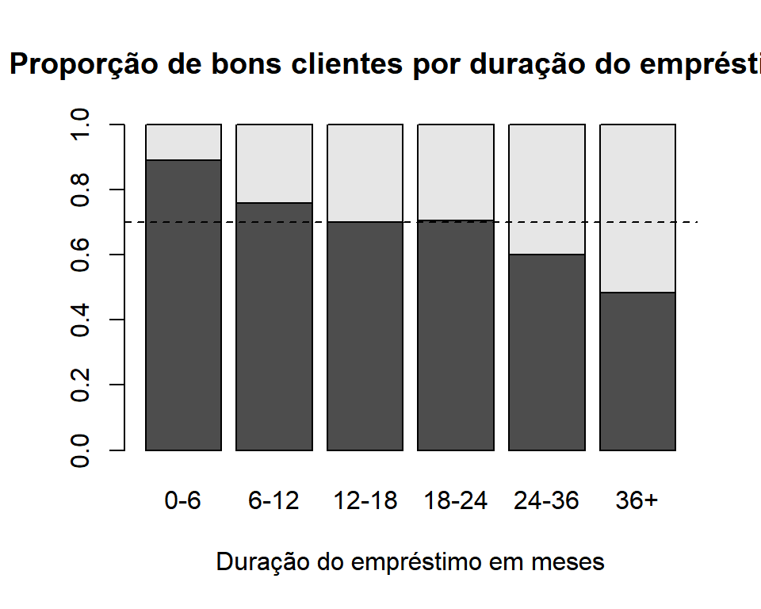

## Inferência


### Exercício 1

No gráfico abaixo, vemos a distribuição do logaritmo das indenizações por incêndio na Dinamarca. Mesmo após aplicar o logaritmo, vemos que a distribuição dos dados ainda é bastante assimétrica.


### Exercício 2

As distribuições Gama e Lognormal podem ser ajustadas aos dados de indenizações usando a função `fitdist` do pacote `fitdistrplus`, que encontra os estimadores de máxima verossimilhança para as distribuições especificadas. Os valores dos estimadores estão na Tabela 1.


```r
## ajustando gama e lognormal
x = x + 0.0001  # adicionando constante para evitar zeros
fgam = fitdist(x, "gamma", lower=0) # gama
flnorm = fitdist(x, "lnorm")        # lognormal
```


params.        Gama  params.     Lognormal
--------  ---------  --------  -----------
shape      1.125610  meanlog    -0.7454713
rate       1.430252  sdlog       1.2797658


### Exercício 3

No gráfico abaixo, vemos o histograma dos valores transformados das indenizações, juntamente com as curvas das distribuições Gama e Lognormal ajustadas, e a curva da densidade empírica. De acordo com as densidades, vemos que a densidade da Gama está mais próxima da densidade observada nos dados.


```r
## comparativo das densidades ajustadas
denscomp(list(fgam, flnorm), legendtext=c("Gama","Lognormal"), demp=T,
         main="Histograma e densidades ajustadas")
```


### Exercício 4


```r
## comparativo das funções de distribuição e qq-plot
par(mfrow=c(1,2))
cdfcomp(list(fgam, flnorm), datacol="grey", lwd=2, 
        legendtext=c("Gama","Lognormal"), main="Funções de distribuição ajustadas")
qqcomp(list(fgam, flnorm), main="QQ-plot Dados de Incêndio",
       legendtext=c("Gama","Lognormal"), fitpch=c(4,20))
```


De acordo com os gráficos das funções de distribuição acumulada ajustadas e dos quantis teóricos e empíricos, vemos que a distribuição gama tem um ajuste mais próximo da distribuição observada nos dados.


### Exercício 5


```r
## quantil observado
qemp = quantile(x, prob=.95)

## quantis teóricos
qgam = qgamma(.95, shape=fgam$estimate[1], rate=fgam$estimate[2])
qlnorm = qlnorm(.95, meanlog=flnorm$estimate[1], sdlog=flnorm$estimate[2])
```


            Emp       Gama   Lognormal
----  ---------  ---------  ----------
95%    2.299929   2.261656    3.894464


Novamente, pela comparação entre os quantis de 95% empírico e teóricos, vemos que a distribuição gama apresentou um ajuste mais próximo aos dados observados.


## Aprendizagem Estatística


### Exercício 6

No gráfico abaixo, vemos a distribuição marginal da variável `checking_status` que mostra o saldo da conta corrente em marcos alemães dos clientes do banco de dados de análise de crédito. Vemos que as categorias com saldo negativo e saldo até 200 marcos contém 27% dos dados cada, enquanto a categoria com saldo acima de 200 marcos concentra apenas 6% dos clientes. A categoria com maior frequência, com quase 40% dos dados, é a de clientes sem conta corrente ou que não se sabe.


Para analisar se há diferença na distribuição dessa variável `checking_status` com relação à classificação dos clientes, vemos abaixo a proporção de clientes classificados como bons (`class`=0) ou ruins (`class`=1) em cada categoria de saldo da conta corrente. Vemos que nas duas primeiras categorias (saldo negativo e saldo até 200 marcos alemães), a proporção de bons e maus clientes é parecida, em torno de 50% e 60% respectivamente. Já na categoria de saldo maior que 200 marcos, 77% dos clientes foram classificados como bons. Para clientes sem conta corrente ou conta desconhecida, essa proporção aumenta para 88%. Essas proporções podem ser visualizadas para as quatro categorias de conta corrente no gráfico abaixo, com a proporção geral destacada na linha pontilhada.


Table: Classificação dos clientes de acordo com o saldo em conta corrente

               0       1
--------  ------  ------
<0         0.507   0.493
0-200      0.610   0.390
>200       0.778   0.222
não tem    0.883   0.117


### Exercício 7

Na tabela e no gráfico abaixo, vemos a proporção de clientes classificados como bons de acordo com a duração do empréstimo. Para empréstimos com menos de 6 meses, quase 90% dos clientes são classificados como bons. Podemos ver que essa proporção diminui a medida em que a duração do empréstimo aumenta, chegado a 48% para empréstimos com mais de 3 anos.


Table: Classificação dos clientes de acordo com a duração do empréstimo em meses

             0       1
------  ------  ------
0-6      0.890   0.110
6-12     0.758   0.242
12-18    0.701   0.299
18-24    0.705   0.295
24-36    0.601   0.399
36+      0.483   0.517




