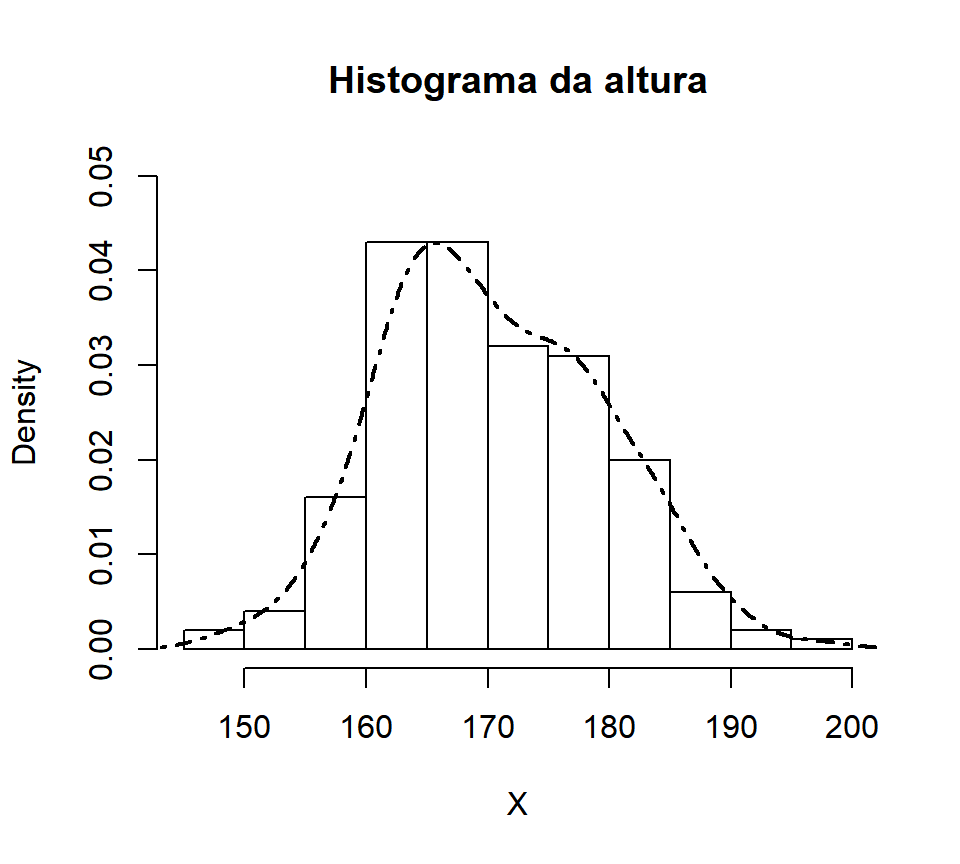
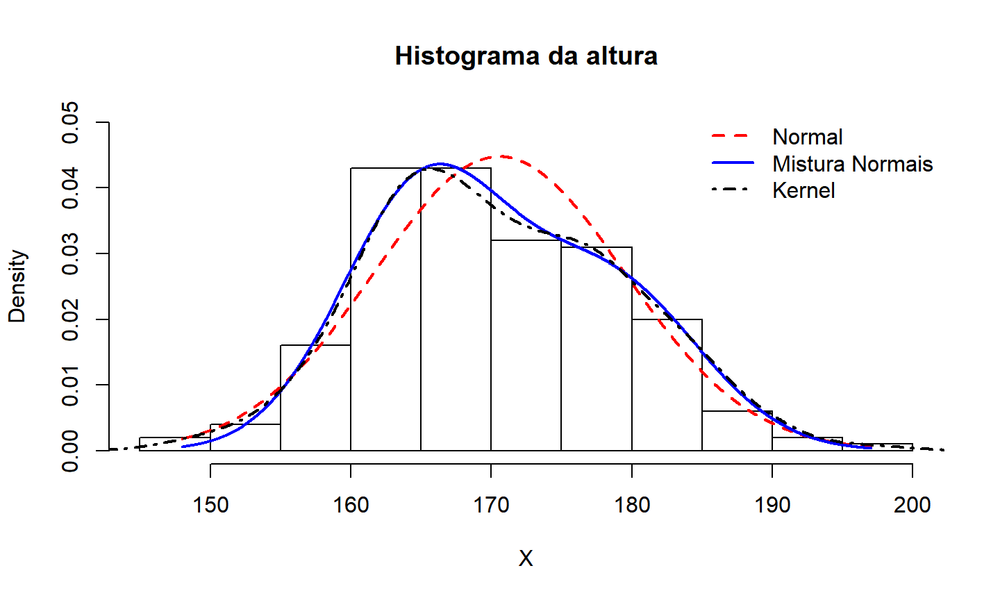
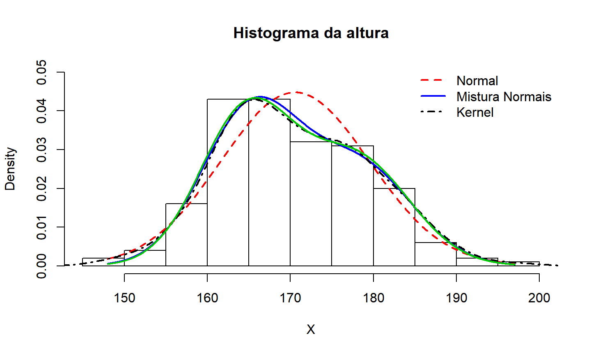

## Aula de Hoje

- Regressão Linear

- Perda Agregada


# Regressão Linear


## Regressão Linear

- Até agora, estamos fazendo inferência assumindo que observações são **i.i.d.**, por exemplo, com distribuição $Normal(\mu,\sigma^2)$.

- Em muitos casos, esse modelo pode ser muito restritivo.

- Vamos ver com um exemplo.


## <span class="green3"> Exemplo - Distribuição altura</span>

- Base de dados `Davis` do pacote `CASdatasets`

- Contém dados de 200 indivíduos sobre: sexo, peso em kg e altura em cm.


```r
## Dados de peso e altura de 200 indivíduos (Fonte: Davis, 1990)
require(CASdatasets)
data(Davis)
head(Davis,3)
```

```
##   sex weight height reportedWeight reportedHeight
## 1   M     77    182             77            180
## 2   F     58    161             51            159
## 3   F     53    161             54            158
```


## <span class="green3"> Exemplo - Distribuição altura</span>


```r
## ajustando altura
X = Davis$height
hist(X, freq=F, main="Histograma da altura", ylim=c(0,0.05))
lines(density(X), lwd=2, lty=4)
```




## <span class="green3"> Exemplo - Distribuição altura</span>

- Distribuição Normal?


```r
## ajustando distribuição normal
require(fitdistrplus)
mod.normal = fitdist(X, "norm")
param = mod.normal$estimate
param
```

```
##      mean        sd 
## 170.56500   8.90987
```


## <span class="green3"> Exemplo - Distribuição altura</span>


## <span class="green3"> Exemplo - Distribuição altura</span>

- Mistura de duas normais?

$$X \quad \sim \quad p.\, N(\mu_1,\sigma^2_1) + (1-p).\,N(\mu_2,\sigma^2_2) $$


```r
## Mistura de duas Normais
## log da densidade
logdf = function(x,parameter){
  p = parameter[1]; m1 = parameter[2]; m2 = parameter[3]
  s1 = parameter[4]; s2 = parameter[5]
  return(log(p*dnorm(x,m1,s1)+(1-p)*dnorm(x,m2,s2)))
}
```


## <span class="green3"> Exemplo - Distribuição altura</span>

- Nesse caso, temos várias restrições para serem satisfeitas ao mesmo tempo: $p \in (0,1)$ e $\sigma_1,\sigma_2 \in (0,\infty)$.

  + Em notação matricial para $\boldsymbol \theta = (p, \mu_1, \mu_2, \sigma_1, \sigma_2)'$:

$$\begin{pmatrix} 1&0&0&0&0 \\ -1&0&0&0&0 \\ 0&0&0&1&0 \\ 0&0&0&0&1 \end{pmatrix} \boldsymbol \theta + \begin{pmatrix} 0 \\ 1 \\ 0 \\ 0 \end{pmatrix} \geq \boldsymbol 0 $$

- Precisamos usar outra função de otimização para encontrar o **Estimador de Máxima Verossimilhança**.


## <span class="green3"> Exemplo - Distribuição altura</span>

- Vamos usar a função `constrOptim()` que encontra o *mínimo* de uma função sob restrições lineares.


```r
logL = function(parameter) -sum(logdf(X,parameter))

## restrições
Amat = matrix(c(1,-1,0,0,0,0,0,0,0,0,1,0,0,0,0,0,0,0,0,1), 4, 5)
bvec = c(0,-1,0,0)
mix1 = constrOptim(c(.5,160,180,10,10), logL, NULL, ui = Amat, ci = bvec)$par
mix1
```

```
## [1]   0.5996263 165.2690084 178.4991624   5.9447675   6.3564746
```


## <span class="green3"> Exemplo - Distribuição altura</span>

- Outra maneira seria usar o [algoritmo EM](https://en.wikipedia.org/wiki/Expectation%E2%80%93maximization_algorithm) para encontrar o EMV.


```r
## outra maneira - algoritmo EM
require(mixtools)
mix2 = normalmixEM(X)
```

```
## number of iterations= 201
```

```r
c(mix2$lambda[1], mix2$mu, mix2$sigma)
```

```
## [1]   0.1501924 163.7585213 171.7679496   2.5654084   9.0894452
```


## <span class="green3"> Exemplo - Distribuição altura</span>




## <span class="green3"> Exemplo - Distribuição altura</span>

- Para o <span class="blue3">**modelo de mistura**</span>, consideramos que a variável da mistura $\Theta$ era uma *variável latente*, isto é, não observada, a ser estimada pelo modelo.

- Mas considerando a estrutura dos nossos dados, temos uma *variável observada* que seria uma boa variável para determinar os grupos da mistura.


## <span class="green3"> Exemplo - Distribuição altura</span>


## <span class="green3"> Exemplo - Distribuição altura</span>

- Vamos ajustar um <span class="blue3">**modelo de mistura**</span> para os diferentes sexos:

$$X \quad \sim \quad p_M\,.\, N(\mu_M,\sigma^2_M) + p_F\,.\,N(\mu_F,\sigma^2_F) $$

- Aqui, $p_M$ e $p_F$ são as proporções de homens e mulheres na população, respectivamente.


## <span class="green3"> Exemplo - Distribuição altura</span>


```r
## Ajustando a mistura por sexo
sex = Davis$sex
(pM = mean(sex=="M"))
```

```
## [1] 0.44
```

```r
(paramF = fitdistr(X[sex=="F"],"normal")$estimate)
```

```
##       mean         sd 
## 164.714286   5.633808
```

```r
(paramM = fitdistr(X[sex=="M"],"normal")$estimate)
```

```
##       mean         sd 
## 178.011364   6.404001
```

## <span class="green3"> Exemplo - Distribuição altura</span>




## <span class="green3"> Exemplo - Distribuição altura</span>

- Na verdade, esse modelo de mistura baseado no sexo é um caso de modelo linear.

- Vamor (re)ver mais detalhes.


## Regressão Linear

- Denote por $Y$ a **variável resposta** (nossa variável de interesse).

- E assuma que temos outras variáveis observadas para os indivíduos que estão relacionadas a $Y$. Vamos denotar essas **covariáveis** por $\boldsymbol X = (\boldsymbol X_1,\dots,\boldsymbol X_k)$.

- Isso quer dizer que para cada observação $Y_i$, também observamos $\boldsymbol X_i=(X_{1,i},\dots,X_{k,i})$.

- As covariáveis (ou variáveis explicativas) $X_k$ podem ser *contínuas* ou *categóricas*.


## Regressão Linear

- No banco de dados `Davis`, a variável de interesse é a **altura**, e as covariáveis são **sexo** e **peso**.

- Ao invés de assumir $Y \sim N(\mu, \sigma^2)$, em um <span class="red3">**modelo de regressão**</span>, vamos assumir que:

$$ Y | \boldsymbol X = \boldsymbol x \quad \sim \quad N \left( \mu(\boldsymbol x), \, \sigma^2\right) $$
onde $\mu(\boldsymbol x)$ agora é uma função das covariáveis.


## Regressão Linear

- No nosso caso, $\boldsymbol x=(x_1,x_2)$, onde $x_1$ é o sexo e $x_2$ é o peso em kg dos indivíduos. Assim, $\mu(x_1,x_2)=\beta_0 + \beta_{1,M}.\mathbb{1}(x1=M) + \beta_{1,F}.\mathbb{1}(x1=F) + \beta_2.x_2$.

- O modelo com $\mu(x_1,x_2)$ acima não pode ser *identificado*, não podemos ter o intercepto mais um parâmetro para cada um dos grupos. O usual é manter o intercepto e escolher um dos grupos para ser a categoria de referência.

- Podemos escrever o modelo completo como:

$$ Y = \beta_0 + \beta_{1,M}.\mathbb{1}(x1=M) + \beta_2.x_2 + \varepsilon  $$
onde $\varepsilon \sim N(0,\sigma^2)$ é o erro.

- Parâmetros a serem estimados: $\beta_0$, $\beta_{1,M}$, $\beta_2$ e $\sigma^2$.


## Regressão Linear - Inferência

- O Estimador de Máxima Verossimilhança pode ser obtido maximizando-se:

$$\mathcal{L} \left( (\boldsymbol \beta, \sigma); \boldsymbol y, \boldsymbol x \right) = \prod_{i=1}^n \varphi(y_i\,;\,\beta_0+ \beta_1 x_1 + \beta_2 x_2, \sigma^2 ) $$
onde $\varphi(y; \mu,\sigma^2)$ é a densidade da normal.

- Nesse modelo, encontrar o EMV é o mesmo que minimizar a soma dos quadrados dos resíduos (Método dos Mínimos Quadrados).


## <span class="green3">Regressão Linear - Exemplo</span> {.smaller}

- Podemos ajustar um **modelo de regressão linear** no R usando a função `lm()`.


```r
mod.lin = lm(Y~X1+X2)
summary(mod.lin)
```

```
## 
## Call:
## lm(formula = Y ~ X1 + X2)
## 
## Residuals:
##      Min       1Q   Median       3Q      Max 
## -14.4301  -3.0775   0.2414   3.3052  18.9547 
## 
## Coefficients:
##              Estimate Std. Error t value Pr(>|t|)    
## (Intercept) 145.86123    2.26947  64.271  < 2e-16 ***
## X1M           6.99928    1.04305   6.710 2.01e-10 ***
## X2            0.33138    0.03896   8.506 4.50e-15 ***
## ---
## Signif. codes:  0 '***' 0.001 '**' 0.01 '*' 0.05 '.' 0.1 ' ' 1
## 
## Residual standard error: 5.157 on 197 degrees of freedom
## Multiple R-squared:   0.67,	Adjusted R-squared:  0.6666 
## F-statistic:   200 on 2 and 197 DF,  p-value: < 2.2e-16
```


## <span class="green3">Regressão Linear - Exemplo</span>

- **Predições**: e se quisermos estimar a altura de três pessoas com sexo M, M e F e peso 100kg, 70kg e 65kg, respectivamente?


```r
new.obs = data.frame(X1=c("M","M","F"),X2=c(100,70,65))
predict(mod.lin, newdata=new.obs)
```

```
##        1        2        3 
## 185.9983 176.0570 167.4008
```


# Perda Agregada


## Perda Agregada

- Já vimos a definição de **soma aleatória** ou **perda agregada**:

$$S = \sum_{i=1}^N X_i $$
onde $N$ é o <span class="red3">número de indenizações</span> e $(X_i)$ é o <span class="red3">valor de cada indenização</span>, com $S=0$ se $N=0$.


## Distribuição da Soma Agregada

- Suposições:

  + $N$ e $X_i$ são independentes;
  
  + $(X_i) \stackrel{iid}{\sim} F_X$.

- Assim, a **função de distribuição acumulada** da soma agregada é:

$$ F_S(s) = \sum_{n=0}^{\infty} \mathbb{P}(N=n).\, \mathbb{P}(X_1+\dots+X_n \leq s) $$


## Distribuição da Soma Agregada

- Para algumas distribuições, conseguimos encontrar facilmente a distribuição da soma $X_1 + \dots + X_n$.

- Por exemplo, se $X_i \sim Gama(\alpha, \lambda)$, então

$$X_1 + \dots + X_n \sim Gama(n\alpha, \,\lambda) $$

- Em geral, a distribuição da soma $S = X_1 + \dots + X_n$ não terá necessariamente a mesma distribuição de $X$.

- Há algumas alternativas para computar a distribuição da soma agregada nesses casos (recursão de Panjer, aproximação normal, aproximação potência da normal, aproximação Gama - ver Seção 2.5.1). Esses métodos estão implementados na função `aggregateDist` no pacote `actuar`.


## Processo de Poisson

- O <span class="blue3">**Processo de Poisson**</span> é um dos processos estocásticos mais importantes para seguros.

- É utilizado para descrever o <span class="blue3">número de sinistros</span> que ocorreram em um intervalo de tempo.

- É um **processo de contagem** com incrementos *independentes* e *estacionários* (distribuição não muda com o tempo).


## Processo de Poisson

- $N_t$: número de sinistros que ocorreram até o tempo $t$. 

$$N_t \sim Poisson(\lambda) $$

- $(T_i)$: tempo até a $i$-ésima ocorrência

$$\{ N_t = n \} = \{ T_n \leq t \;\;\cap\;\;  T_{n+1}>t\} \quad \mbox{para todo } n \geq 1$$

- $W_i = T_i - T_{i-1}$: tempo entre ocorrências

- Quando $W_i \sim exp(\lambda)$, então $(N_t)$ é um **Processo de Poisson**.


## Processo de Poisson

- Processo de Poisson Homogêneo:

$$ \mathbb{P}(N_{t+h} - N_t = k) = \frac{1}{k!} e^{-\lambda h} (\lambda h)^k $$

- Processo de Poisson Não-homogêneo:

$$ \mathbb{P}(N_{t+h} - N_t = k) = \frac{1}{k!} e^{-\int_t^{t+h} \lambda_s \, ds} \left(\int_t^{t+h} \lambda_s \, ds \right)^k $$


## Processo de Poisson

- Alguns algoritmos para gerar um Processo de Poisson são apresentados na seção 2.5.2.

- Uma aplicação usual é quando temos <span class="blue3">**seguros com franquias**</span>.

  + Suponha que as ocorrências de sinistros seguem um Processo de Poisson com intensidade $\lambda$, e as indenizações individuais tem distribuição $F$.
  
  + Então o processo de indenizações acima da franquia $d$ também segue um Processo de Poisson com intensidade $[1-F(d)].\lambda$.
  
- **Processo de Poisson composto**: $S_t = \displaystyle \sum_{i=1}^{N_t} X_i$ onde $N_t$ é PP e $X_i$'s são v.a.'s iid (seção 2.5.3).


[//]: # ##########################################################
[//]: # Para gerar arquivo com apenas os comandos do R desta aula


